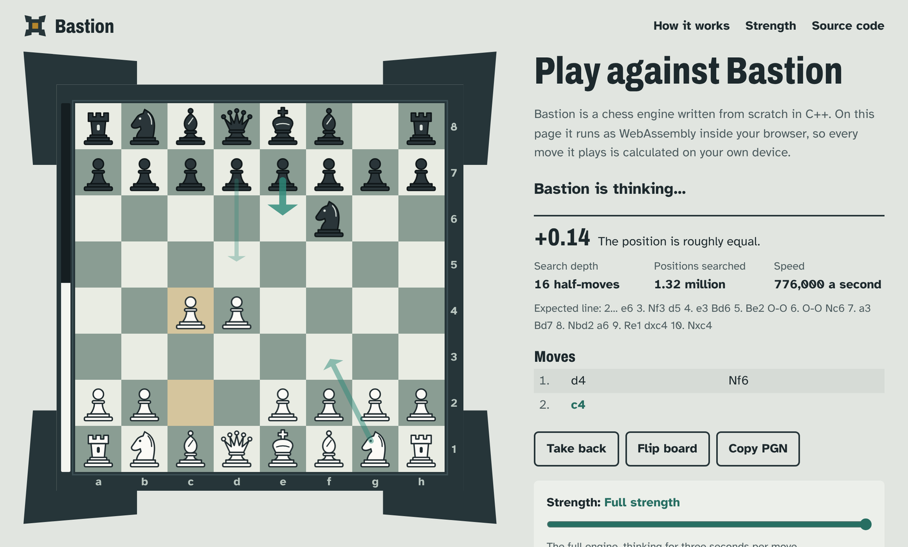

<div align="center">



# Bastion

**A chess engine written from scratch in C++20, with an estimated rating of about 2870 on the CCRL blitz scale.**

[](https://github.com/husnainbh-123/Bastion/actions/workflows/ci.yml)
[](https://husnainbh-123.github.io/Bastion/)
[](LICENSE)

[**Play it in your browser**](https://husnainbh-123.github.io/Bastion/) · [How it works](docs/HOW_IT_WORKS.md) · [Test results](docs/TESTING.md) · [Run it on Lichess](bot/README.md)

</div>

Bastion speaks the [UCI protocol](https://backscattering.de/chess/uci/), so it works in any chess GUI
(Arena, Cute Chess, Nibbler, BanksiaGUI), and it compiles to WebAssembly to run in the browser.

## Highlights

- **Strength:** about **2867** on the CCRL blitz scale (95% interval 2817–2916), estimated from 160 games against reference engines. The original target was 2500.
- **Correct move generation:** magic bitboards, verified by perft against 27 reference positions (over 800 million leaf nodes).
- **Modern search:** principal variation search with a transposition table, null move pruning, late move reductions,
  singular extensions and history-based move ordering, with the value of the main techniques measured in engine matches.
- **Learned evaluation:** 564 middlegame/endgame weight pairs fitted by gradient descent to 1,024,029 positions from 11,978 self-play games, worth +237 ± 51 Elo in games against the untuned version.
- **Engineering:** CI on Linux, Windows and macOS; AddressSanitizer and UBSan; libFuzzer on the parsers that take
  untrusted input; a deterministic `bench` node count that CI checks against the commit message; strength
  changes measured in engine matches.
- **Runs in the browser:** the same C++ compiled to a 313 KB WebAssembly module, running in a Web Worker.

## Strength

Estimated from games against reference engines with known ratings on the
[CCRL blitz list](https://computerchess.org.uk/ccrl/404/) scale: [Stash](https://github.com/mhouppin/stash-bot) 25
and Stockfish held back to calibrated skill levels (8 seconds + 0.08 seconds per move, one thread, balanced openings):

| Opponent | Rating | Games | Bastion scored | Performance |
| --- | ---: | ---: | ---: | ---: |
| Stash 25 | 2744 | 60 | 80.0% | 2985 |
| Stockfish, skill level 11 | 2856 | 30 | 26.7% | 2680 |
| Stockfish, skill level 13 | 2973 | 44 | 30.7% | 2831 |
| Stockfish, skill level 15 | 3070 | 14 | 39.3% | 2994 |
| Stockfish, skill level 17 | 3141 | 12 | 12.5% | 2803 |
| **All games** | | **160** | | **2867** (95% interval 2817–2916) |

Against Stash alone Bastion performed at about 2985, against the Stockfish levels alone at about 2801; [docs/TESTING.md](docs/TESTING.md#playing-strength) looks at why the two references disagree.

Engine ratings come from engine-versus-engine games and are not directly comparable with human ratings.
The method and raw results are in [docs/TESTING.md](docs/TESTING.md).

## Building

You need a C++20 compiler (GCC 11+, Clang 14+ or MSVC 2022) and CMake 3.16+.

```bash
cmake -S . -B build -DCMAKE_BUILD_TYPE=Release -DBASTION_NATIVE=ON   # NATIVE: optimise for this CPU
cmake --build build --parallel
ctest --test-dir build --output-on-failure                          # perft, unit and bench tests
./build/bastion
```

Or, without CMake: `make` builds `./bastion` with `-march=native`.

| Build | Command |
| --- | --- |
| Sanitizers | `cmake -S . -B build-asan -DBASTION_SANITIZE=ON` |
| Fuzzers (clang) | `CXX=clang++ cmake -S . -B build-fuzz -DBASTION_FUZZ=ON`, then `./build-fuzz/fuzz_fen fuzz/corpus/fen` |
| WebAssembly | `make wasm` (needs clang and wasi-libc; on Ubuntu: `apt install wasi-libc libc++-18-dev-wasm32 libc++abi-18-dev-wasm32`) |
| Website locally | `make wasm`, then `python3 -m http.server -d web` and open <http://localhost:8000> |

Prebuilt binaries for Windows, Linux and macOS are attached to each [release](https://github.com/husnainbh-123/Bastion/releases).

## Usage

Load `bastion` in a chess GUI as a UCI engine, or type commands yourself:

```
position startpos moves e2e4 e7e5
go movetime 2000
info depth 17 seldepth 21 multipv 1 score cp 15 nodes 1986117 nps 1118939 hashfull 768 time 1775 pv g1f3 b8c6 f1b5 a7a6 ...
bestmove g1f3 ponder b8c6
```

| Option | Default | Description |
| --- | --- | --- |
| `Hash` | 16 | Transposition table size in MB |
| `Threads` | 1 | Search threads (Lazy SMP) |
| `Move Overhead` | 30 | Milliseconds kept in reserve per move for communication lag |
| `Skill Level` | 20 | 0–19 weaken the engine by adding evaluation noise; 20 is full strength |
| `Clear Hash` | | Empties the transposition table |

Extra commands: `d` (show the board), `eval` (static evaluation), `perft <depth>`, `bench [depth]`
(fixed-depth search signature) and `datagen <games> <nodes> <file> [seed]` (self-play data for tuning).

## Project layout

```
src/            engine (board, move generation, search, evaluation, UCI, WebAssembly API)
tests/          perft suite, unit tests, WebAssembly test
fuzz/           libFuzzer harnesses and seed inputs
tools/tuner/    Texel tuner for the evaluation weights
tools/testing/  SPRT, gauntlet and ablation scripts (fastchess)
web/            the website: board UI, Web Worker and the engine loader
bot/            Lichess bot configuration and guide
docs/           design notes and test results
```

## Acknowledgements

- The [Chess Programming Wiki](https://www.chessprogramming.org), the reference for nearly every technique used here.
- Ronald Friederich's PeSTO piece-square tables, the starting point for the evaluation before tuning.
- [Stash](https://github.com/mhouppin/stash-bot) by Morgan Houppin, used as a rating reference, with ratings from
  Stockfish's [UCI_Elo calibration](https://github.com/official-stockfish/Stockfish/commit/a08b8d4e9711c20acedbfe17d618c3c384b339ec).
- [fastchess](https://github.com/Disservin/fastchess) for running engine matches, and
  [lichess-bot](https://github.com/lichess-bot-devs/lichess-bot) for the Lichess bridge.
- Developed with [Claude](https://claude.ai) (Anthropic) as an AI pair programmer.

## License

[MIT](LICENSE)
